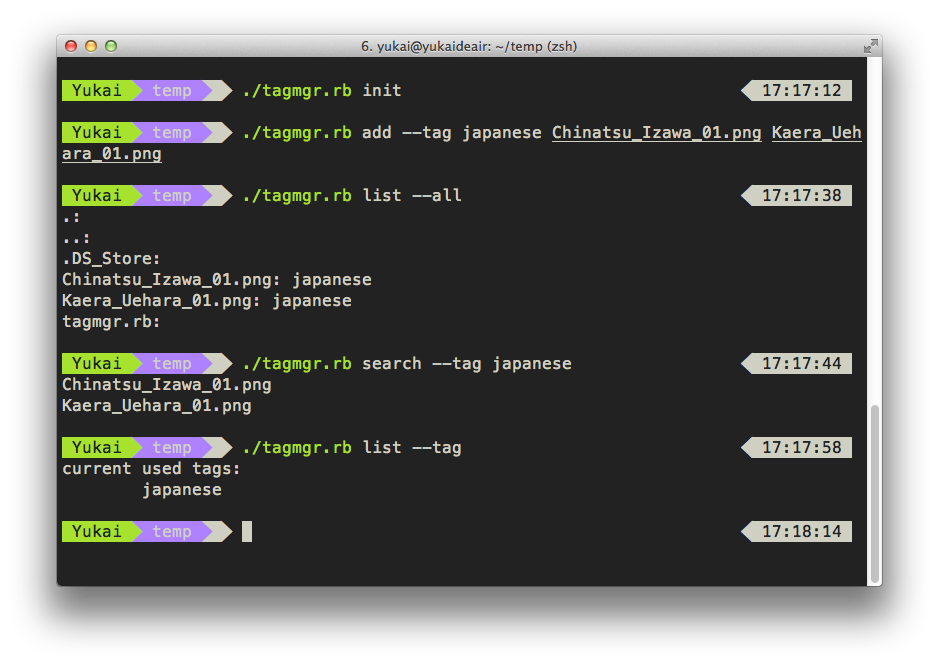

#Simple File Tag Manager using Ruby and Clamp

##Overview
Inspire by my future Software Engineering Course Final Project(read the **Use Requirement** [here](https://hackpad.com/-Use-Requirement-RzuVlOBv6S9))

The Project should be written in JAVA (WTF). However, I made a CLI version, implementing basic operations, including:

* add tag to files
* remove tag from files
* list current tags
* list all files with tags
* search file by tag name

Powered by a smart CLI program framework, [clamp by mdub](https://github.com/mdub/clamp)

##Dependency

Use Bundler.

	bundle intall

##Usage

You can type `./tagmgr.rb --help` to see how to use.

Here are some examples:

	# initialize our database
	./tagmgr.rb init

	# add 'japanese' tag to files
	./tagmgr.rb add --tag japanese Chinatsu_Izawa_01.png Kaera_Uehara_01.png

	# list files with tag names
	./tagmgr.rb list --all

	# search by tag name
	./tagmgr.rb search --tag japanese

	# remove specific tag from files
	./tagmgr.rb remove --tag japanese Chinatsu_Izawa_01.png Kaera_Uehara_01.png

	# list used tags
	./tagmgr.rb list --tag

